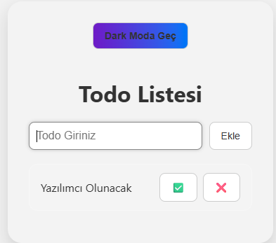
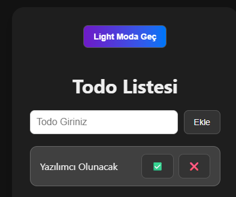
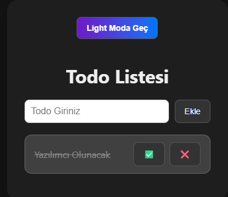

# ✅ React ToDo App

Bu proje, React kullanılarak geliştirilmiş basit ve işlevsel bir ToDo (Yapılacaklar Listesi) uygulamasıdır. Kullanıcılar görev ekleyebilir, tamamlayabilir ve silebilir. Ayrıca Light/Dark tema desteği mevcuttur.

## 🚀 Proje Özellikleri

- Görev ekleme
- Görev tamamlama
- Görev silme
- Light/Dark tema desteği
- Kullanıcı dostu arayüz

## 📦 Kullanılan Teknolojiler

- React
- JavaScript (ES6+)
- HTML/CSS

## 📸 Ekran Görüntüleri

### 🎨 Tema Görünümleri

#### Light Theme


#### Dark Theme


### 📝 Tamamlanmış Görevler


## 🔧 Kurulum ve Çalıştırma

Projeyi kendi bilgisayarınızda çalıştırmak için şu adımları takip edin:

```bash
# 1. Reposu klonlayın
git clone https://github.com/mehmet2725/todo_react.git

# 2. Klasöre geçin
cd todo_react

# 3. Bağımlılıkları yükleyin
npm install

# 4. Uygulamayı başlatın
npm start
